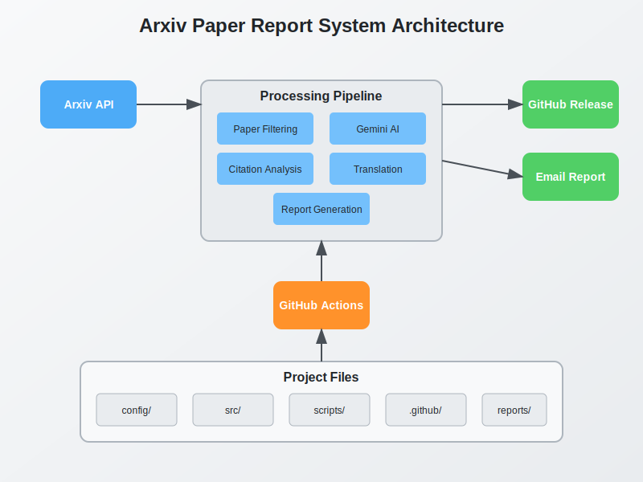

# Arxiv Paper Report System

An automated system that generates daily reports on the latest Computer Vision and Pattern Recognition papers from Arxiv, based on keywords and citation metrics.

## Recent Updates

- **Paper Scoring**: Added intelligent paper scoring using Gemini API to rank papers by relevance and significance
- **Performance Optimization**: Disabled thinking budget in Gemini API calls for better command following and cost savings
- **PDF Processing**: Fixed bug in PDF reading functionality
- **Repository Structure**: Updated folder structure for better organization


## Features

- Daily monitoring of new Arxiv papers in Computer Vision and Pattern Recognition
- Keyword-based filtering to match your research interests
- AI-powered summarization and analysis using Google's Gemini API
- Automated report generation in Markdown/HTML format
- Email notifications with daily findings
- GitHub Actions automation for daily execution
- **NEW**: Paper relevance and significance scoring using Gemini AI
- **NEW**: Optimized Gemini API usage with disabled thinking budget for better command following and cost savings
- **NEW** Allow usiog `uv sync` to directly create local environment from pyproject.toml

## System Architecture

The following diagram illustrates the architecture and workflow of the Arxiv Paper Report System:



## Repository Structure

```
arxiv-analyzer/
├── config/                   # Configuration files
│   ├── keywords.json         # Keywords for paper filtering
│   └── config.json           # General configuration
├── src/                      # Source code
│   ├── arxiv/                # Arxiv API interaction
│   │   ├── client.py         # Arxiv API client
│   │   └── parser.py         # Parse Arxiv responses
│   ├── llm/                  # LLM integration
│   │   ├── gemini.py         # Google Gemini API client
│   │   └── prompts/          # Prompt templates
│   │       ├── summary.txt           # Summary generation prompt
│   │       ├── review.txt            # Critical review prompt
│   │       ├── relevance_scoring.txt # Paper scoring prompt
│   │       ├── report_summary.txt    # Report summary prompt
│   │       └── translate.txt         # Translation prompt
│   ├── output/               # Output generation
│   │   ├── markdown.py       # Markdown report generator
│   │   └── email.py          # Email notification
│   └── utils/                # Utility functions
│       ├── citation.py       # Citation metrics
│       ├── filters.py        # Paper filtering logic
│       └── ranking.py        # Paper ranking and selection
├── scripts/                  # Scripts
│   ├── run_daily_report.py   # Main script for daily execution
│   └── test_local.py         # Local testing script
├── tests/                    # Unit tests
├── .github/                  # GitHub configuration
│   └── workflows/            # GitHub Actions workflows
│       └── daily_report.yml  # Daily report workflow
├── pyproject.toml            # Python project configuration
├── requirements.txt          # Python dependencies
└── README.md                 # Project documentation
```

## Setup and Usage

1. Clone this repository
2. Install dependencies: `pip install -r requirements.txt`
3. Configure your keywords in `config/keywords.json`
4. Set up your Google API keys as environment variables or in GitHub secrets
5. Run locally: `python scripts/test_local.py`
6. The GitHub Action will run automatically every day

## Configuration

Edit `config/keywords.json` to specify your research interests. The system will filter papers based on these keywords.

### Paper Scoring System

The system now features an advanced paper scoring mechanism using Google's Gemini API:

- **Relevance Score (1-3)**: Measures how well a paper matches your research interests
- **Significance Score (1-3)**: Evaluates the paper's scientific impact and importance
- **Combined Score**: Sum of relevance and significance scores, used for ranking

Papers are automatically filtered based on minimum combined score thresholds that you can configure in `config/config.json`.

## GitHub Actions Setup

To enable GitHub Actions:

1. Add your Google API key as a GitHub secret named `GOOGLE_API_KEY`
2. Add your email credentials as GitHub secrets
3. The workflow will run daily and send reports to your email
4. The daily report contents will be released in Github.

## Local Testing

Run `python scripts/test_local.py` to test the system locally. Make sure to set the required environment variables.