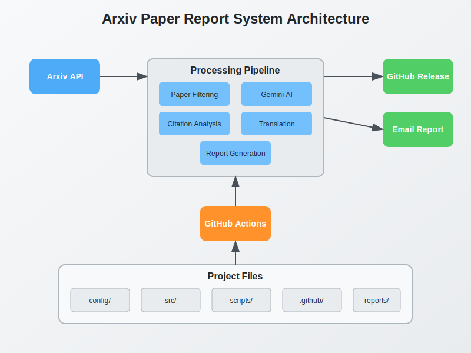

# Arxiv Paper Report System

An automated system that generates daily reports on the latest Computer Vision and Pattern Recognition papers from Arxiv, based on keywords and citation metrics.

## Recent Updates

- **Multi-Provider LLM Support**: Now supports both Google Gemini and Volcengine Ark (ByteDance Doubao) as LLM backends
- **Modular Architecture**: Refactored LLM clients with abstract base class and factory pattern
- **Lazy Imports**: SDK dependencies are only loaded when the corresponding provider is used
- **Paper Scoring**: Added intelligent paper scoring using LLM to rank papers by relevance and significance
- **Performance Optimization**: Disabled thinking budget in API calls for better command following and cost savings
- **PDF Processing**: Fixed bug in PDF reading functionality
- **Repository Structure**: Updated folder structure for better organization

## Features

- Daily monitoring of new Arxiv papers in Computer Vision and Pattern Recognition
- Keyword-based filtering to match your research interests
- **Multi-provider AI support**: Google Gemini or Volcengine Ark (ByteDance Doubao)
- AI-powered summarization and analysis
- Automated report generation in Markdown/HTML format
- Email notifications with daily findings
- GitHub Actions automation for daily execution
- Paper relevance and significance scoring using LLM
- Optimized LLM API usage with disabled thinking budget

## System Architecture

The following diagram illustrates the architecture and workflow of the Arxiv Paper Report System:



### LLM Provider Architecture

```
src/llm/
├── base.py       # BaseLLMClient abstract class
├── factory.py    # create_llm_client() factory function
├── gemini.py     # GeminiClient (Google Gemini API)
├── ark.py        # ArkClient (Volcengine Doubao)
└── prompts/      # Shared prompt templates
```

## Repository Structure

```
arxiv-analyzer/
├── config/                   # Configuration files
│   ├── keywords.json         # Keywords for paper filtering
│   ├── config.json           # Gemini configuration (default)
│   └── config_ark.json       # Volcengine Ark configuration
├── src/                      # Source code
│   ├── arxiv/                # Arxiv API interaction
│   │   ├── client.py         # Arxiv API client
│   │   └── parser.py         # Parse Arxiv responses
│   ├── llm/                  # LLM integration
│   │   ├── base.py           # Abstract base class
│   │   ├── factory.py        # Client factory
│   │   ├── gemini.py         # Google Gemini client
│   │   ├── ark.py            # Volcengine Ark client
│   │   └── prompts/          # Prompt templates
│   │       ├── summary.txt           # Summary generation prompt
│   │       ├── abstract_analysis.txt # Abstract analysis prompt
│   │       ├── relevance_scoring.txt # Paper scoring prompt
│   │       ├── report_summary.txt    # Report summary prompt
│   │       └── translate.txt         # Translation prompt
│   ├── output/               # Output generation
│   │   ├── markdown.py       # Markdown report generator
│   │   └── email.py          # Email notification
│   └── utils/                # Utility functions
│       ├── citation.py       # Citation metrics
│       ├── filters.py        # Paper filtering logic
│       └── ranking.py        # Paper ranking and selection
├── scripts/                  # Scripts
│   ├── run_daily_report.py   # Main script for daily execution
│   └── test_local.py         # Local testing script
├── tests/                    # Unit tests
│   ├── test_llm_base.py      # Base class tests
│   ├── test_llm_factory.py   # Factory tests
│   └── test_llm_gemini.py    # Gemini client tests
├── .github/                  # GitHub configuration
│   └── workflows/            # GitHub Actions workflows
│       └── daily_report.yml  # Daily report workflow
├── .cursor/docs/             # AI agent documentation
├── pyproject.toml            # Python project configuration
├── requirements.txt          # Python dependencies
└── README.md                 # Project documentation
```

## Setup and Usage

### Installation

```bash
# Clone this repository
git clone <repo-url>
cd everyday_my_arxiv

# Install with uv (recommended)
uv sync

# Or with pip
pip install -r requirements.txt

# For Volcengine Ark support (optional)
uv sync --extra ark
# or
pip install 'volcengine-python-sdk[ark]'
```

### Configuration

1. Configure your keywords in `config/keywords.json`
2. Choose your LLM provider:
   - **Gemini**: Use `config/config.json` (default)
   - **Ark**: Use `config/config_ark.json`

### Environment Variables

#### For Google Gemini
```bash
export GOOGLE_API_KEY="your-google-api-key"
```

#### For Volcengine Ark
```bash
export ARK_API_KEY="your-ark-api-key"
```

#### For Email (optional)
```bash
export EMAIL_SMTP_SERVER="smtp-mail.outlook.com"
export EMAIL_SMTP_PORT="587"
export EMAIL_SENDER="your-email@outlook.com"
export EMAIL_PASSWORD="your-password"
export EMAIL_RECIPIENT="recipient@example.com"
```

### Running

```bash
# With Gemini (default)
uv run scripts/run_daily_report.py

# With Ark
uv run scripts/run_daily_report.py --config config/config_ark.json

# Explicit provider override
uv run scripts/run_daily_report.py --config config/config.json --provider ark

# Local testing with fewer papers
uv run scripts/test_local.py --papers 3 --no-email
```

## LLM Provider Configuration

### Google Gemini (`config/config.json`)

```json
{
  "llm": {
    "model": "gemini-2.5-flash",
    "temperature": 0.2,
    "max_output_tokens": 4096,
    "summary_length": "medium",
    "batch_size": 16
  }
}
```

### Volcengine Ark (`config/config_ark.json`)

```json
{
  "llm": {
    "provider": "ark",
    "text_model": "doubao-seed-1-6-251015",
    "document_model": "doubao-seed-1-6-251015",
    "base_url": "https://ark.cn-beijing.volces.com/api/v3",
    "temperature": 0.2,
    "max_output_tokens": 4096,
    "summary_length": "medium",
    "batch_size": 16
  }
}
```

## Paper Scoring System

The system features an advanced paper scoring mechanism:

- **Relevance Score (1-3)**: Measures how well a paper matches your research interests
- **Significance Score (1-3)**: Evaluates the paper's scientific impact and importance
- **Combined Score**: Sum of relevance and significance scores, used for ranking

Papers are automatically filtered based on minimum combined score thresholds that you can configure in your config file.

## GitHub Actions Setup

To enable GitHub Actions:

1. Add your LLM API key as a GitHub secret:
   - `GOOGLE_API_KEY` for Gemini
   - `ARK_API_KEY` for Ark (if using)
2. Add your email credentials as GitHub secrets
3. The workflow will run daily and send reports to your email
4. The daily report contents will be published to GitHub Wiki

## Testing

```bash
# Run all tests
uv run pytest tests/ -v

# Run specific test file
uv run pytest tests/test_llm_factory.py -v
```

## AI Agent Documentation

Comprehensive documentation for AI agents is available in `.cursor/docs/`:

- `00-system-overview.md` - Architecture and high-level workflow
- `01-workflow-detailed.md` - Step-by-step execution flow
- `02-module-reference.md` - API reference for all modules
- `03-configuration.md` - Configuration guide
- `04-github-actions.md` - CI/CD workflow details
- `05-api-prompts.md` - LLM integration and prompts

## License

MIT License
